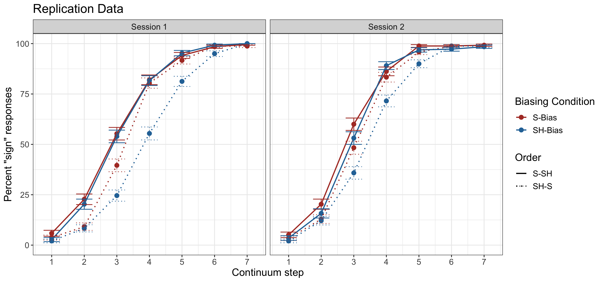
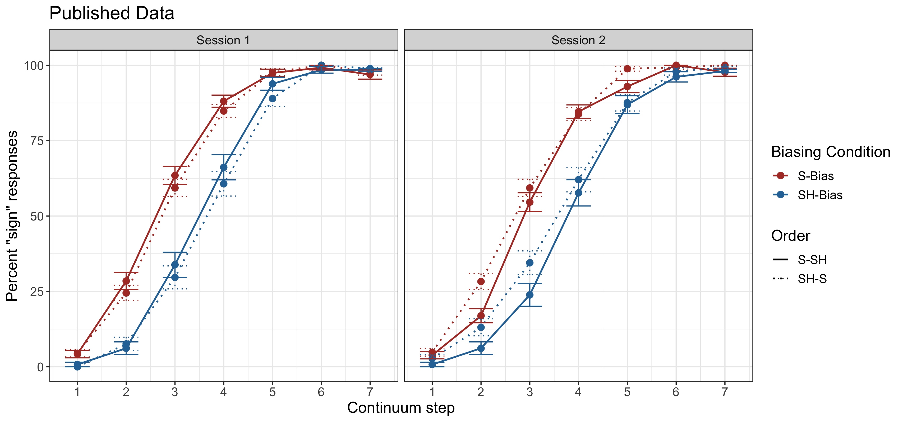

## Saltzman & Myers (2018) Replication

### Background
A colleague of ours, whom with we shared the data from the published manuscript, identified an issue in our stimulus presentation during the phonetic categorization phase. While we believed that there were 8 repetitions of each of the 7 stimulus steps, a programming error lead to uneven distributions of each continuum step. Therefore, it is possible the effects we saw were due to selective adaptation and not lexically-guided perceptual learning.

The published data and analysis code are availalble in this repository under "Published Data". 

### Replication
We performed a corrected replication (with the intended stimulus distributions in the phonetic categorization phase) of the original experiment using the online platform Prolific. Experimental presentation was handled through Gorilla, which included two headphone checks to ensure that participants used roughly similar equipment to that which was used in the lab. 120 participants were recruited.

We allowed participants to begin session 2 at a minimum of 7 days (the average time between session 1 and 2 in SM2018) after their first session completed. As in SM2018, we only included participants who completed both sessions, and used the same accuracy criteria (minimum 80% accuracy at each endpoint during the phonetic categorization tasks) to exclude participants. In addition, we excluded any participant who failed both headphone checks. The resulting sample includes 62 participants. 

### Results from the replication

In the **published study**, there were three main conclusions:

1. *A main effect of Bias* - listeners show maximal flexibility when adapting to novel speech information, that is they will shift and reshift category boundaries as incoming phonetic information changes

2. *No Bias x Session interaction* - listeners appear to use local statistics and do not aggregate talker-specific information over time, as there was no change in the bias effect from one session to another

3. *No Bias x Order interaction* - the order of biasing blocks did not have an effect 

In the **replication**, each of these conclusions changed in the following way:

1. *A main effect of Bias was found*. We again found evidence of the main conclusion, which is that listeners will shift and reshift category boundaries as incoming phonetic information changes

2. *A Bias x Order x Session interaction was found*. To explore this interaction, we looked at change in the Bias effect for the SH-S order (the one that showed the flexible adaptation) from session 1 to session 2. A Bias x Session interaction was marginally significant (*p* = .06), indicating that there was less evidence of listeners shifting and reshifting their category boundaries in session 2. Therefore, it seems more likely that listeners are slowly aggregating statistics about the talker over time.

3. *A Bias x Order interaction was found*. That is, only participants who received the SH-S order showed evidence of shifting and reshifting their category boundaries, which is largely attributable to acoustic imbalances inherent in the fricatives produced in the original stimuli (see Drouin, Theodore, & Myers, 2015 for an explanation).

#### Replication results figure:

#### Published results figure:

